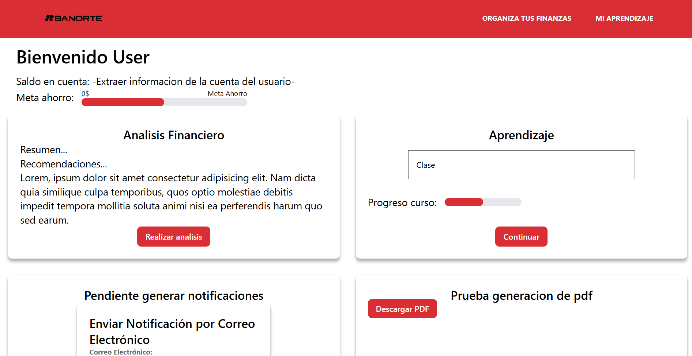
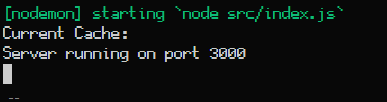
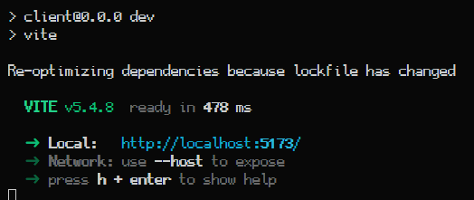

# Hackathon Banorte 2024

## Revolucionando la educacion financiera!

Para nuestra solución, hemos implementado un entorno que integra el potencial de la inteligencia artificial generativa, la visión por computadora y las tecnologías más avanzadas en desarrollo web dentro de la industria de TI.



## Iniciar el proyecto

1. Tener instalada la herramienta de GCP CLI
2. Iniciar sesion con la cuenta del proyecto con Document AI y Vertex AI
3. Ejecutar el siguiente comando en dos terminales diferentes en los siguientes paths:

- `~/server/`
- `~/client/`

Ejecucion:

```bash
npm install
npm run dev
```

Deberas visualizar pantallas similares a las siguientes:

- `~/server/`



- `~/client/`

